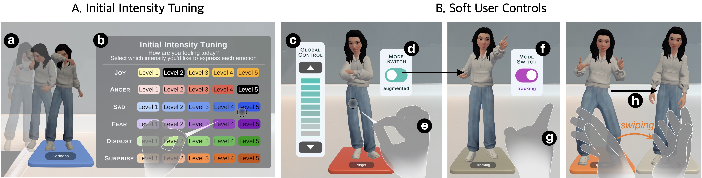

# **EmoShortcuts**

**Authors**: [HyunA Seo](https://hyunaseo.github.io), Youngki Lee, Rajesh Balan, Thivya Kandappu

**Publication**: ACM UIST, Sept 2025

**Paper**: [EmoShortcuts: Emotionally Expressive Body Augmentation for Social Mixed Reality Avatar](https://dl.acm.org/doi/10.1145/3746059.3747656)

## Research project description
We present **EmoShortcuts**, a novel social Mixed Reality (MR) framework that enhances emotional expression by dynamically augmenting avatar body gestures to reflect users’ emotional states. While social MR enables immersive remote interactions through avatars, conveying emotions remains challenging due to limitations in head-mounted display (HMD) tracking (e.g., missing lower-body movements, such as stomping or defensive postures), and users’ tendency to deprioritize nonverbal expressions during multitasking. EmoShortcuts addresses these challenges by introducing an augmentation framework that generates expressive body gestures even when users’ physical movements are restricted. We identified key challenges in emotional expression and explore user preferences for AI-assisted gesture augmentation. Based on these insights, we designed an interface that enables adaptive gesture augmentation, allowing for both preset and real-time user control.

## Hardware Requirements
- Meta Quest Pro for facial expression tracking

